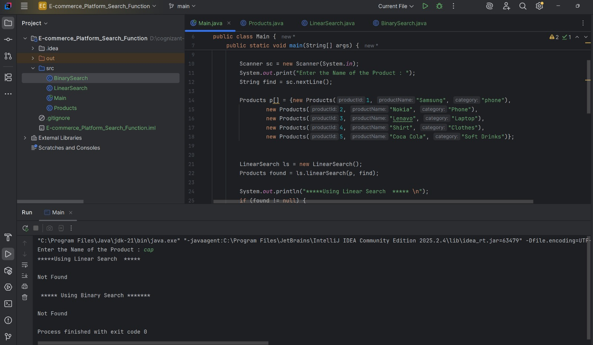
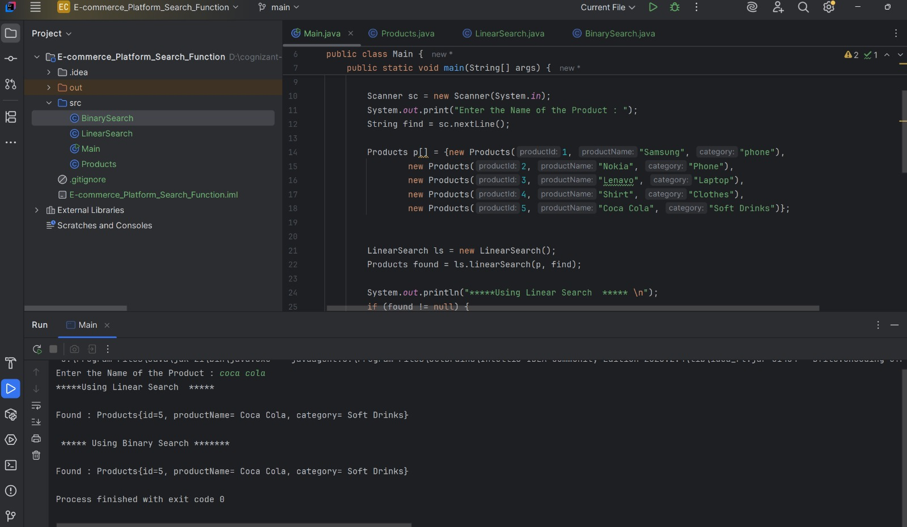

Search Algorithm Analysis

Linear Search

- Best case: O(1) — element is first in array
- Average case: O(n)
- Worst case: O(n) — element is last or not present
- Works on unsorted data

Binary Search
- Best case: O(1) — element is exactly at middle
- Average case: O(log n)
- Worst case: O(log n)
- Requires sorted data

  

  

