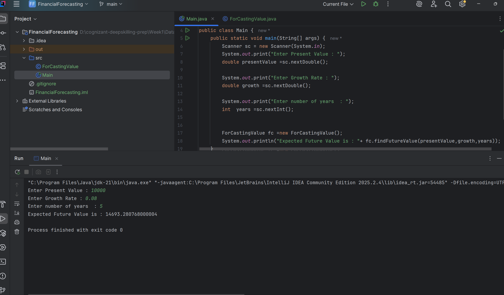
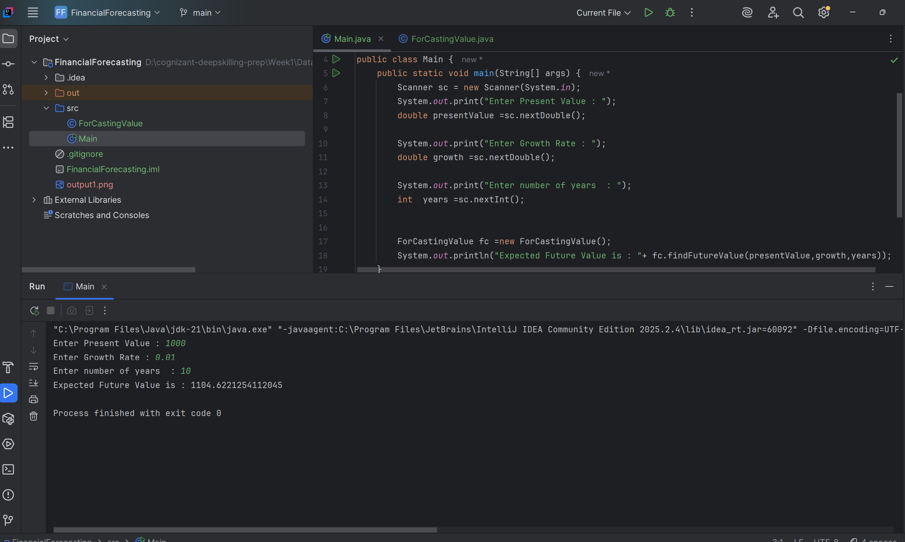

## Recursion

- Basically Recursion is a Concept where a particular bolck gets executed countinously until base limit reaches 
## Future Value Forecaste Approach
- Calculates future value using compound growth: each year's value becomes
the input for the next year's calculation, recursively, until the
year counter reaches 0 (base case).

## Outputs

  
  

