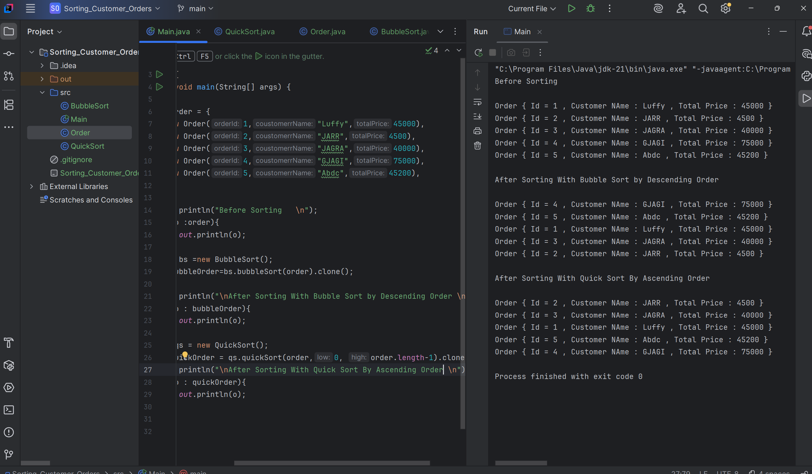

## Bubble Sort 
 I have used Bubble Sort for sorting the Customer Orders in Descending Order by TotalPrice 
 - 
- The Best Case in terms of Time Complexity is O(n) and in Worst
  O(n²)
## QuickSort
Here i used Quick Sort for Sorting the Customer Orders in Ascending by TotalPrice 
-
- The Best Case in terms of Time Complexity is O(n log n) and in Average
  O(n log n)  and on Worst case O(n²)

