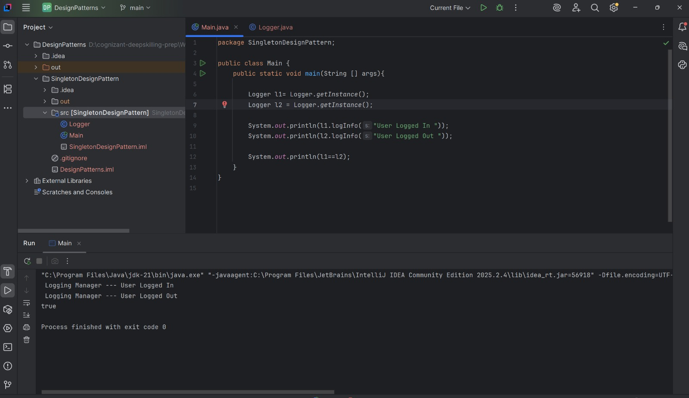
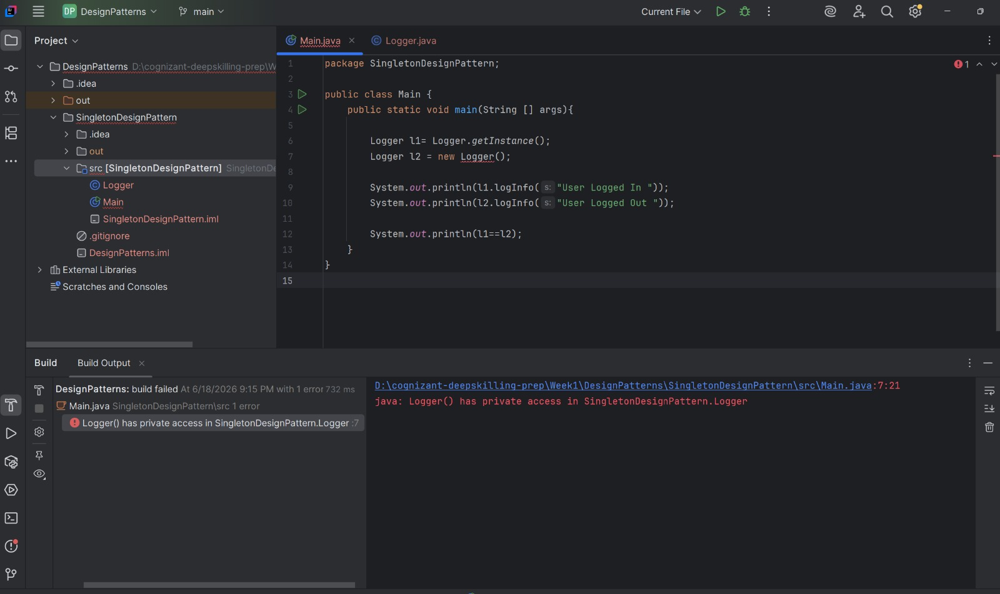

Singleton Design Pattern

An example of a very simple implementation of the Singleton Design Pattern with a Logger class. The program illustrates that there can be only one Logger and that it can be used globally in the application.

Output
Same Instance Verification

Both l1 and l2 refer to the same instance of Logger, as can be seen in the output below, which is because of the Singleton behavior.

Restricting Object Creation

If an attempt is made to create a Logger object using new Logger() from the Main class, a compilation error is likely to occur since the constructor in the Logger class is declared private, which means that it cannot be invoked from outside the class.

